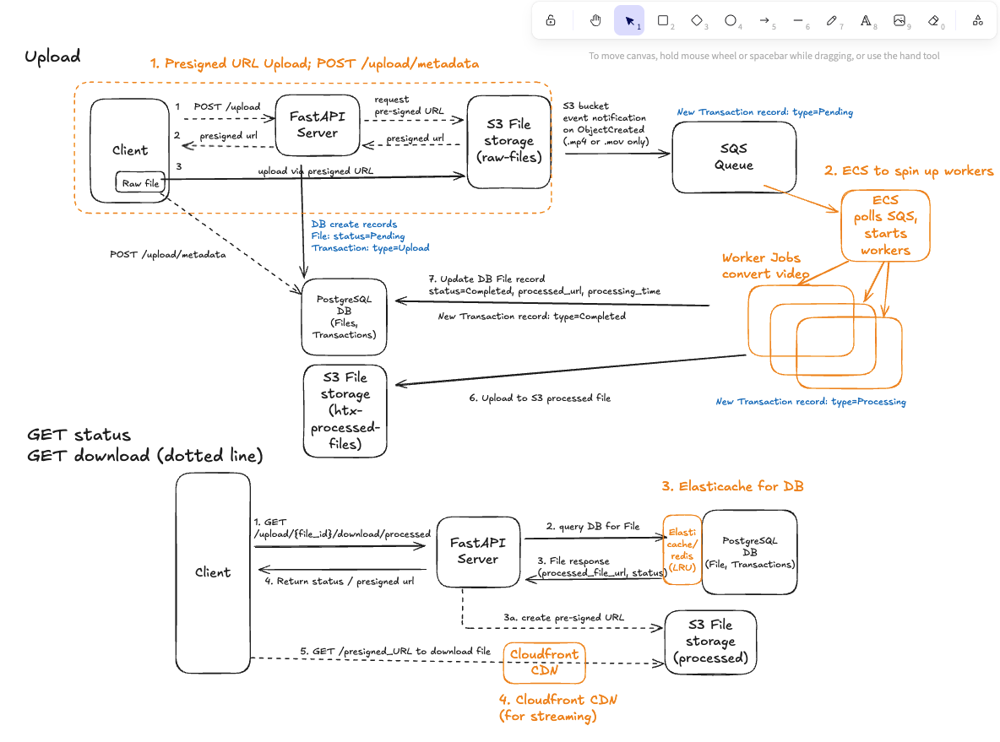

# Video Processing Service


This project provides a backend service for transcoding video files from H.264 to H.265 (HEVC) and vice-versa. 

## Architecture
- **FastAPI:** Python web server that handles upload requests and status checks.
- **Worker (Python/ffmpeg):** A service that pulls jobs from a queue and processes the files
- **S3:** Stores raw (original) and processed video files.
- **SQS:** A message queue that decouples the API from the worker, ensuring reliability.
- **PostgreSQL:** A relational database to track Files and Transactions

#### Current Architecture


#### To-Be Architecture (Future, not implemented)


#### Assumptions / Considerations
1. Only video files .mp4 or .mov are accepted (file type filter on S3 to SQS Event Nofitication)
2. For upload, we can use a s3 presigned URL for reliabile, scalable production architecture. However this makes it client-side resposibility to upload the file to the S3 presigned URL which is not the best flow for this POC. 
3. Deployment to ECS is ideal but not covered in this POC
4. [Future change] Currently File on upload has default status=PENDING. It should have status=UPLOADED, and only changed to status=PENDING when in the SQS queue (dependent on successful s3 upload)
---

## Prerequisites

1.  **AWS Account:** With an IAM User, Access Key and Secret Key. 
    - The user requires permissions to manage S3 buckets, SQS queues, and their associated policies.
2.  **AWS CLI:** Installed and configured with your credentials (`aws configure`).
3.  **Docker & Docker Compose:** Installed and running on your machine.
4.  **FFmpeg:** Required by the test script to verify video codecs. 
    - Install via `brew install ffmpeg` (macOS) or `sudo apt install ffmpeg` (Debian/Ubuntu).
## Setup and Execution

1. Configure env variables 
    ```bash
    cp .env.aws.template .env.aws
    ```
2.  Open `.env.aws` and fill in your `AWS_ACCESS_KEY_ID`, `AWS_SECRET_ACCESS_KEY`, and desired `AWS_REGION`.


3. Provision AWS Resources - Run the initialization script with a globally unique suffix for your S3 buckets (e.g., `my-unique-suffix`).
    ```bash
    chmod +x aws-init.sh
    ./aws-init.sh my-unique-suffix
    ```
4. The script will output the names of the created resources. Copy these into `.env.aws` file. (i.e, `S3_RAW_BUCKET`, `S3_PROCESSED_BUCKET`, `SQS_QUEUE_URL`)

5. Run Application - Build and start all services in the background. There should be 3 docker containers running: `worker`, `api`, `db-
    ```bash
    docker-compose up --build
    ````

## Quick Start / Tests 
See `Tests.md` for the full instructions and results.

With the docker application running, there are 3 ways you can test the application:

1. SwaggerAPI at `http://localhost:8000/docs#/` and use "Try it out" button
2. End to end tests with `test_upload.py`. 
    ```bash
    pip install requests # If not already installed
    python test_upload.py
    ```
3. Inspect PostgreSQL Database Files, Transactions if needed (eg with Docker Desktop)


## Clean Up
To terminate the docker application, run
```bash
docker-compose down --volumes
```

To avoid ongoing AWS charges, destroy the cloud resources (S3 buckets, SQS queue) when you are finished. 
The script will use your `.env.aws` file to identify the correct region.
```bash
chmod +x aws-destroy.sh
./aws-destroy.sh my-unique-suffix
```

# API Definition

Interactive API documentation is available at [http://localhost:8000/docs](http://localhost:8000/docs) or [http://localhost:8000/redoc](http://localhost:8000/redoc).

There are 5 API endpoints. 

### 1. Initiate File Upload

Initiates the upload process by requesting a secure, temporary link to which the file can be uploaded directly.

* **Endpoint:** `POST /upload`

    ```json
    // Request Body
    {
      "file_name": "my-awesome-video.mp4"
    }
    ```

    ```json
    // Success Response (200 OK)
    {
      "file_id": "a1b2c3d4-e5f6-a7b8-c9d0-e1f2a3b4c5d6",
      "upload_url": "[https://my-s3-bucket.s3.amazonaws.com/](https://my-s3-bucket.s3.amazonaws.com/)...",
      "s3_key": "my-awesome-video-a1b2c3d4-e5f6-a7b8-c9d0-e1f2a3b4c5d6.mp4"
    }
    ```

### 2. Get Job Status

Retrieves the current status and metadata for a specific transcoding job using its `file_id`.

* **Endpoint:** `GET /upload/{file_id}/status`

    ```json
    // Success Response (200 OK)
    {
      "file_id": "a1b2c3d4-e5f6-a7b8-c9d0-e1f2a3b4c5d6",
      "file_name": "my-awesome-video.mp4",
      "processing_status": "completed",
      "original_codec": "h264",
      "target_codec": "hevc",
      "processing_time": 42.7
    }
    ```
    
    ```json
    // Error Response (404 Not Found)
    {
      "detail": "File with ID a1b2c3d4-e5f6-a7b8-c9d0-e1f2a3b4c5d6 not found."
    }
    ```

### 3. Download Original File 

Gets a temporary (valid for 1h), secure link to download the original, unprocessed file.

* **Endpoint:** `GET /upload/{file_id}/download/original`

    ```json
    // Success Response (200 OK)
    {
      "download_url": "[https://my-s3-bucket.s3.amazonaws.com/](https://my-s3-bucket.s3.amazonaws.com/)..."
    }
    ```

    ```json
    // Error Response (404 Not Found)
    {
        "detail": "File with ID a1b2c3d4-e5f6-a7b8-c9d0-e1f2a3b4c5d6 not found."
    }
    ```


### 4. Download Processed File

Gets a temporary (valid for 1h), secure link to download the final, processed file.

* **Endpoint:** `GET /upload/{file_id}/download/processed`

    ```json
    // Success Response (200 OK)
    {
      "download_url": "[https://my-s3-bucket.s3.amazonaws.com/](https://my-s3-bucket.s3.amazonaws.com/)..."
    }
    ```
    
    ```json
    // Error Response (404 Not Found)
    // if the File status is not yet 'completed'.
    {
        "detail": "Processed file not available. Current status: processing"
    }
    ```
